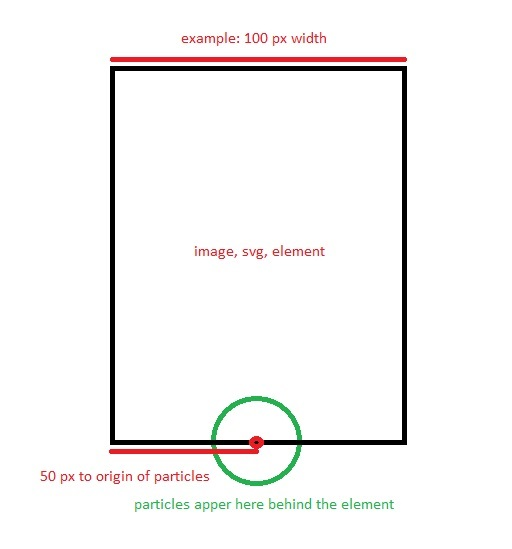

# moving-background-icon

With the aid of this library you can add moving elements on your websites. The element follows a random path, rotates accordingly and has the option for particles or path that follows it behind.

## Installation

To install it just download the js library and import it with a script tag in your html file. In the future if there is any interest CDN can be added.

~~~ html

~~~

## Usage

To use the library just put any element in your html with the "backgroundIcon" classname. You can put as many elements as you want but adding more than 10 might make it laggy: 

~~~ html

~~~

To remove the particles add "noParticles" class name as follows: 

~~~ html

~~~

Every element can have different moving speed which can be changed by adding custom "speed" attribute to the element: 

~~~ html

~~~~

Recomended speed is anything between 1-10, if ommited default speed is 3.

## Note

* If the particles does not follow the image correctly on a mobile phones resolution add this line in your header tag: 

~~~ html
<meta name="viewport" content="width=device-width, initial-scale=1, minimum-scale=1" />
~~~

* To edit the size of the image do the following in your css file: 

~~~ css
.backgroundIcon{
  width: width-in-pixels !important;
  height: height-in-pixels !important;
}
~~~

* I have uploaded html file as example how to use the library. I have left the rocket.svg image to be used as example with the particles which looks like rocket flame. 

* if you don't see the icon by any chance check if there is an element that takes the whole screen and has a z-index bigger than -1 (like background image)

* Another note is that if you are using your own svg, image or element keep in mind that the particles would appear in the middle of the bottom side of the element as such: 

## Author 

Written by Atanas Kolev 
